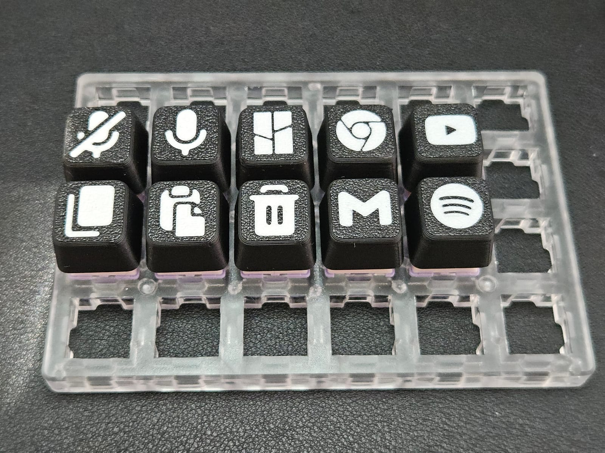
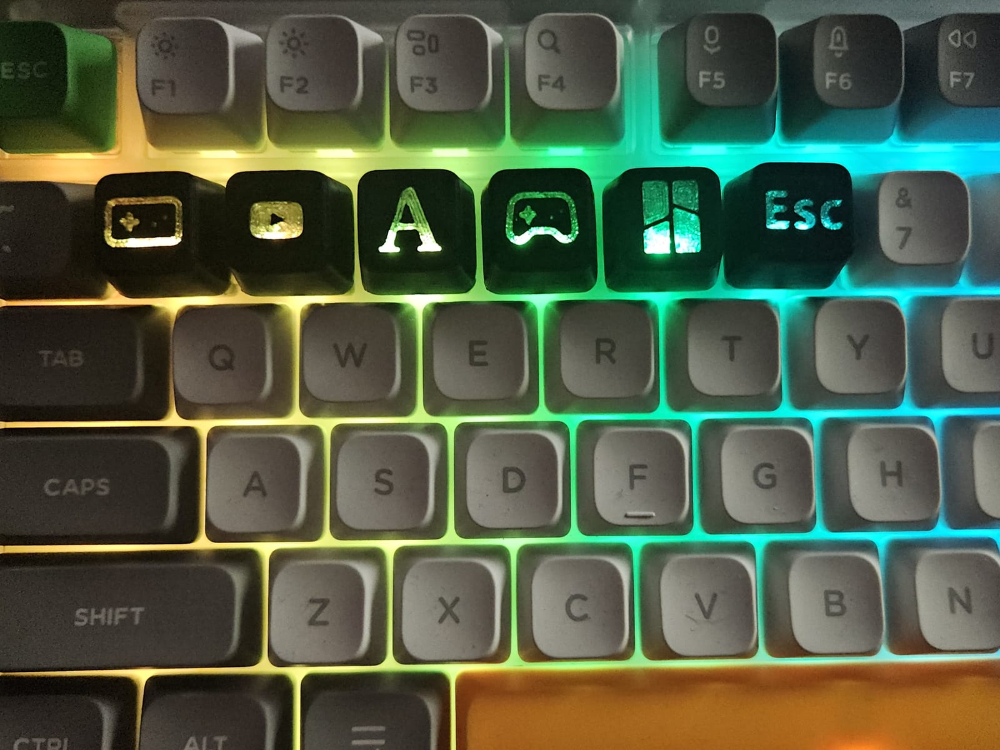

# Keycap Legend Generator

Design a custom keyboard keycap in your browser — drop on an icon, a brand logo, or a
letter — and export a ready-to-print **two-color 3MF**: the keycap in one filament, the
legend in another. No CAD, no sign-up, nothing to install.

### ▶ [Open the generator](https://vostoklabs.github.io/SVG-keycap-generator/)


Printed results (grab the [MakerWorld print profile](https://makerworld.com/en/@Vostok_Labs)
for the best finish):

| All sizes | Icons & SVG logos | Shine-through |
| --- | --- | --- |
|  |  |  |

## What you can do

- **Pick a size** — 1u, 1.25u, 1.5u, 1.75u, 2u, 2.25u, 2.75u and 6u / 6.25u / 6.5u
  spacebars, each with the correct Cherry MX-style switch stems.
- **Choose a legend** — search thousands of [Lucide](https://lucide.dev) icons, **upload
  your own SVG** (brand logos from [Simple Icons](https://simpleicons.org) work great), or
  **type** a letter, number, symbol or short word in any of ~30 built-in fonts (or import
  your own `.ttf` / `.otf`).
- **Place it exactly** — size, depth, rotation, nudge and mirror, with a live 3D preview.
- **Two colors** — set the cap and legend colors; the preview matches the exported file.
- **Shine-through mode** — carves the legend clear through the top so it lights up when you
  print the legend (and stem) in transparent filament.
- **Clean export** — a two-color 3MF that opens as a single object with two pre-colored
  parts, ready to slice.

## How to print

1. [Open the generator](https://vostoklabs.github.io/SVG-keycap-generator/), design your
   keycap, and click **Export 3MF**.
2. Open the file in your slicer (PrusaSlicer / OrcaSlicer / Bambu Studio). It loads as one
   object with two parts — *Keycap* and *Legend* — already colored; assign a filament to each.
3. Orient the cap **top-face-down** so the legend prints as the first layers.
4. For the best quality, use the print profile and instructions on
   [MakerWorld](https://makerworld.com/en/@Vostok_Labs).

## Support

If this saved you a few bucks, you can support it **for free** — download the model on
MakerWorld, give it a like and a boost, and follow the page. Or
[buy me a Ko-fi ☕](https://ko-fi.com/vostoklabs).

## Run it locally

```bash
npm install
npm run dev
```

Built with [Vite](https://vitejs.dev), [three.js](https://threejs.org) and
[manifold-3d](https://github.com/elalish/manifold) (the geometry booleans that carve the
legend into the cap). The keycap meshes ship pre-converted in `public/keycaps/`, so it runs
straight after install.

<details>
<summary>Regenerating the keycap meshes (advanced)</summary>

The cap meshes are tessellated from STEP files with `npm run convert`. The source CAD is
**not** tracked in the repo — only the generated `public/keycaps/**.json` are. STEP files are
grouped by **profile** sub-folder, with the shared homing bump at the top level:

```
Step files of keycaps/
├─ Standard profile/   1 u.stp, 1,25 u.stp, … 6,5 u spacebar.stp
├─ Low profile/        1 u.stp, 1,25 u.stp, … 6,5 u spacebar.stp
└─ Homing bump.stp
```

To add or change a size, drop `.stp` / `.step` files into the relevant profile folder and
re-run the script; the unit and variant are read from the file name (e.g. `6,5 u spacebar.stp`
→ "6.5u Spacebar"), and each sub-folder becomes a profile in the dropdown. Each STEP should
hold the cap shell plus its switch stem(s) as separate solids. The converter writes
`public/keycaps/<profile>/<id>.json` and a `public/keycaps/index.json` manifest the app reads.
</details>

## License & credits

- Code & models: [CC BY-NC-ND 4.0](LICENSE.md) — personal, non-commercial use.
- Letter fonts: [Google Fonts](https://fonts.google.com), SIL Open Font License 1.1 — see
  [`public/fonts/CREDITS.md`](public/fonts/CREDITS.md).
- Icons: [Lucide](https://lucide.dev) (ISC).
